# Sơ Đồ Use Case - Hệ Thống POS

## Sơ Đồ Tổng Quan

```mermaid
graph TB
    %% Actors
    Admin[👨‍💼 Admin]
    Cashier[👩‍💼 Thu Ngân]
    Customer[👤 Khách Hàng]
    
    %% System Boundary
    subgraph POS["🏪 Hệ Thống POS"]
        %% Authentication
        Login[🔐 Đăng Nhập]
        Logout[🚪 Đăng Xuất]
        
        %% Admin Functions
        UserMgmt[👥 Quản Lý Người Dùng]
        SystemSettings[⚙️ Cài Đặt Hệ Thống]
        
        %% Core Business Functions
        InvoiceMgmt[🧾 Quản Lý Hóa Đơn]
        ProductMgmt[📦 Quản Lý Sản Phẩm]
        CategoryMgmt[📂 Quản Lý Danh Mục]
        CustomerMgmt[👥 Quản Lý Khách Hàng]
        
        %% Reports & Analytics
        Reports[📊 Báo Cáo & Thống Kê]
        
        %% Search & Quick Actions
        ProductSearch[🔍 Tìm Kiếm Sản Phẩm]
        QuickInvoice[⚡ Hóa Đơn Nhanh]
    end
    
    %% Admin Relationships
    Admin --> Login
    Admin --> Logout
    Admin --> UserMgmt
    Admin --> SystemSettings
    Admin --> InvoiceMgmt
    Admin --> ProductMgmt
    Admin --> CategoryMgmt
    Admin --> CustomerMgmt
    Admin --> Reports
    Admin --> ProductSearch
    Admin --> QuickInvoice
    
    %% Cashier Relationships
    Cashier --> Login
    Cashier --> Logout
    Cashier --> InvoiceMgmt
    Cashier --> ProductMgmt
    Cashier --> CategoryMgmt
    Cashier --> CustomerMgmt
    Cashier --> Reports
    Cashier --> ProductSearch
    Cashier --> QuickInvoice
    
    %% Customer Relationships
    Customer --> InvoiceMgmt
    Customer --> ProductSearch
    
    %% Styling
    classDef actor fill:#e1f5fe,stroke:#01579b,stroke-width:2px
    classDef adminFunc fill:#f3e5f5,stroke:#4a148c,stroke-width:2px
    classDef coreFunc fill:#e8f5e8,stroke:#1b5e20,stroke-width:2px
    classDef reportFunc fill:#fff3e0,stroke:#e65100,stroke-width:2px
    classDef searchFunc fill:#e3f2fd,stroke:#0d47a1,stroke-width:2px
    
    class Admin,Cashier,Customer actor
    class UserMgmt,SystemSettings adminFunc
    class InvoiceMgmt,ProductMgmt,CategoryMgmt,CustomerMgmt coreFunc
    class Reports reportFunc
    class ProductSearch,QuickInvoice searchFunc
```

## Chi Tiết Các Use Case

### 1. 🔐 Xác Thực (Authentication)
- **Đăng Nhập**: Admin và Thu ngân đăng nhập vào hệ thống
- **Đăng Xuất**: Thoát khỏi hệ thống

### 2. 👨‍💼 Chức Năng Admin
- **Quản Lý Người Dùng**: Tạo, sửa, xóa tài khoản thu ngân
- **Cài Đặt Hệ Thống**: Cấu hình database, tạo dữ liệu mẫu

### 3. 🧾 Quản Lý Hóa Đơn
- **Tạo Hóa Đơn**: Tạo hóa đơn bán hàng mới
- **In Hóa Đơn**: In hóa đơn cho khách hàng
- **Lưu Hóa Đơn**: Lưu hóa đơn vào database

### 4. 📦 Quản Lý Sản Phẩm
- **Thêm Sản Phẩm**: Thêm sản phẩm mới vào hệ thống
- **Sửa Sản Phẩm**: Cập nhật thông tin sản phẩm
- **Xóa Sản Phẩm**: Xóa sản phẩm khỏi hệ thống
- **Quản Lý Kho**: Theo dõi số lượng tồn kho

### 5. 📂 Quản Lý Danh Mục
- **Thêm Danh Mục**: Tạo danh mục sản phẩm mới
- **Sửa Danh Mục**: Cập nhật thông tin danh mục
- **Xóa Danh Mục**: Xóa danh mục khỏi hệ thống

### 6. 👥 Quản Lý Khách Hàng
- **Thêm Khách Hàng**: Đăng ký khách hàng mới
- **Sửa Khách Hàng**: Cập nhật thông tin khách hàng
- **Xóa Khách Hàng**: Xóa khách hàng khỏi hệ thống
- **Tìm Kiếm Khách Hàng**: Tìm kiếm thông tin khách hàng

### 7. 📊 Báo Cáo & Thống Kê
- **Báo Cáo Doanh Thu**: Xem doanh thu theo ngày/tháng
- **Báo Cáo Sản Phẩm**: Thống kê sản phẩm bán chạy
- **Báo Cáo Khách Hàng**: Thống kê khách hàng

### 8. 🔍 Tìm Kiếm & Hành Động Nhanh
- **Tìm Kiếm Sản Phẩm**: Tìm sản phẩm theo tên, mã
- **Hóa Đơn Nhanh**: Tạo hóa đơn cho khách lẻ không cần đăng ký

## Phân Quyền

### 👨‍💼 Admin
- **Toàn quyền**: Có thể thực hiện tất cả chức năng
- **Quản lý người dùng**: Tạo, sửa, xóa tài khoản thu ngân
- **Cài đặt hệ thống**: Cấu hình database, tạo dữ liệu mẫu

### 👩‍💼 Thu Ngân (Cashier)
- **Bán hàng**: Tạo hóa đơn, tìm kiếm sản phẩm
- **Quản lý cơ bản**: Thêm/sửa sản phẩm, danh mục, khách hàng
- **Báo cáo**: Xem báo cáo doanh thu và thống kê
- **Không có quyền**: Quản lý người dùng, cài đặt hệ thống

### 👤 Khách Hàng
- **Mua hàng**: Thông qua thu ngân
- **Tìm kiếm sản phẩm**: Hỗ trợ thu ngân tìm sản phẩm
