# Sơ Đồ Use Case - Hệ Thống POS

## Mô Tả Tổng Quan
Hệ thống POS (Point of Sale) quản lý bán hàng với phân quyền Admin và Cashier.

## Sơ Đồ Use Case

```mermaid
graph TB
    %% Actors
    Admin[👤 Admin<br/>Quản trị viên]
    Cashier[👤 Cashier<br/>Thu ngân]
    
    %% Admin Use Cases
    Admin --> UC1[Quản lý người dùng]
    Admin --> UC2[Quản lý sản phẩm]
    Admin --> UC3[Quản lý danh mục]
    Admin --> UC4[Quản lý khách hàng]
    Admin --> UC5[Xem báo cáo]
    Admin --> UC6[Cài đặt hệ thống]
    Admin --> UC7[Tạo hóa đơn]
    Admin --> UC8[Xem dashboard]
    
    %% Cashier Use Cases
    Cashier --> UC7
    Cashier --> UC9[Tìm kiếm sản phẩm]
    Cashier --> UC10[Xem thông tin khách hàng]
    
    %% Use Case Details
    UC1 --> UC1A[Tạo tài khoản nhân viên]
    UC1 --> UC1B[Sửa thông tin người dùng]
    UC1 --> UC1C[Xóa người dùng]
    UC1 --> UC1D[Phân quyền người dùng]
    
    UC2 --> UC2A[Thêm sản phẩm mới]
    UC2 --> UC2B[Sửa thông tin sản phẩm]
    UC2 --> UC2C[Xóa sản phẩm]
    UC2 --> UC2D[Quản lý giá sản phẩm]
    
    UC3 --> UC3A[Tạo danh mục mới]
    UC3 --> UC3B[Sửa danh mục]
    UC3 --> UC3C[Xóa danh mục]
    
    UC4 --> UC4A[Thêm khách hàng mới]
    UC4 --> UC4B[Sửa thông tin khách hàng]
    UC4 --> UC4C[Xóa khách hàng]
    
    UC5 --> UC5A[Báo cáo doanh thu]
    UC5 --> UC5B[Báo cáo sản phẩm bán chạy]
    UC5 --> UC5C[Báo cáo theo thời gian]
    
    UC6 --> UC6A[Cấu hình cơ sở dữ liệu]
    UC6 --> UC6B[Tạo dữ liệu mẫu]
    UC6 --> UC6C[Xóa dữ liệu mẫu]
    
    UC7 --> UC7A[Thêm sản phẩm vào hóa đơn]
    UC7 --> UC7B[Tính tổng tiền]
    UC7 --> UC7C[In hóa đơn]
    UC7 --> UC7D[Lưu hóa đơn]
    
    UC8 --> UC8A[Xem KPIs]
    UC8 --> UC8B[Xem biểu đồ doanh thu]
    UC8 --> UC8C[Xem thống kê tổng quan]
    
    %% Styling
    classDef actor fill:#e1f5fe,stroke:#01579b,stroke-width:2px
    classDef adminUC fill:#f3e5f5,stroke:#4a148c,stroke-width:2px
    classDef cashierUC fill:#e8f5e8,stroke:#1b5e20,stroke-width:2px
    classDef commonUC fill:#fff3e0,stroke:#e65100,stroke-width:2px
    
    class Admin actor
    class Cashier actor
    class UC1,UC2,UC3,UC4,UC5,UC6,UC8 adminUC
    class UC9,UC10 cashierUC
    class UC7 commonUC
```

## Chi Tiết Use Cases

### 👤 Admin (Quản trị viên)
- **Quản lý người dùng**: Tạo, sửa, xóa tài khoản nhân viên và phân quyền
- **Quản lý sản phẩm**: Thêm, sửa, xóa sản phẩm và quản lý giá
- **Quản lý danh mục**: Tạo và quản lý các danh mục sản phẩm
- **Quản lý khách hàng**: Quản lý thông tin khách hàng
- **Xem báo cáo**: Xem các báo cáo doanh thu và thống kê
- **Cài đặt hệ thống**: Cấu hình cơ sở dữ liệu và dữ liệu mẫu
- **Tạo hóa đơn**: Tạo hóa đơn bán hàng
- **Xem dashboard**: Xem tổng quan hệ thống với KPIs và biểu đồ

### 👤 Cashier (Thu ngân)
- **Tạo hóa đơn**: Tạo hóa đơn bán hàng cho khách
- **Tìm kiếm sản phẩm**: Tìm kiếm sản phẩm để bán
- **Xem thông tin khách hàng**: Xem thông tin khách hàng hiện có

## Luồng Hoạt Động Chính

### 1. Đăng Nhập
- Admin và Cashier đăng nhập với tài khoản riêng
- Hệ thống phân quyền và hiển thị giao diện phù hợp

### 2. Quản Lý (Admin)
- Admin có thể quản lý toàn bộ hệ thống
- Tạo tài khoản cho nhân viên mới
- Quản lý sản phẩm, danh mục, khách hàng

### 3. Bán Hàng (Cashier)
- Cashier tạo hóa đơn bán hàng
- Tìm kiếm sản phẩm và thêm vào hóa đơn
- Tính tổng tiền và in hóa đơn

### 4. Báo Cáo (Admin)
- Admin xem báo cáo doanh thu
- Phân tích hiệu suất bán hàng
- Quản lý tổng quan hệ thống

## Đặc Điểm Hệ Thống
- **Phân quyền rõ ràng**: Admin có quyền cao nhất, Cashier có quyền hạn chế
- **Giao diện thân thiện**: Thiết kế hiện đại với màu sắc hài hòa
- **Đa ngôn ngữ**: Hỗ trợ tiếng Việt hoàn toàn
- **Báo cáo chi tiết**: Nhiều loại báo cáo và biểu đồ trực quan
- **Quản lý tập trung**: Admin quản lý toàn bộ hệ thống từ một nơi
