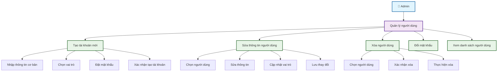
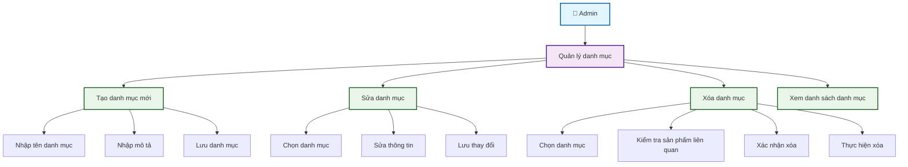
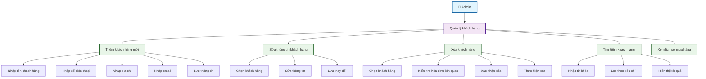
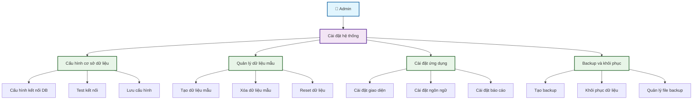
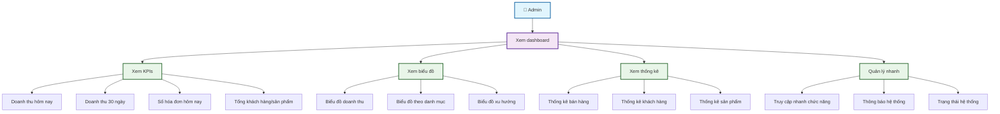

# Sơ Đồ Use Case Chi Tiết - Từng Chức Năng

## 1. Quản Lý Người Dùng (User Management)

## 2. Quản Lý Sản Phẩm (Product Management)

```mermaid
graph TB
    Admin[👤 Admin]
    
    Admin --> UC2[Quản lý sản phẩm]
    
    UC2 --> UC2A[Thêm sản phẩm mới]
    UC2 --> UC2B[Sửa sản phẩm]
    UC2 --> UC2C[Xóa sản phẩm]
    UC2 --> UC2D[Tìm kiếm sản phẩm]
    UC2 --> UC2E[Xem danh sách sản phẩm]
    
    UC2A --> UC2A1[Nhập tên sản phẩm]
    UC2A --> UC2A2[Nhập mã sản phẩm]
    UC2A --> UC2A3[Chọn danh mục]
    UC2A --> UC2A4[Nhập giá bán]
    UC2A --> UC2A5[Nhập mô tả]
    UC2A --> UC2A6[Lưu sản phẩm]
    
    UC2B --> UC2B1[Chọn sản phẩm]
    UC2B --> UC2B2[Sửa thông tin]
    UC2B --> UC2B3[Cập nhật giá]
    UC2B --> UC2B4[Lưu thay đổi]
    
    UC2C --> UC2C1[Chọn sản phẩm]
    UC2C --> UC2C2[Xác nhận xóa]
    UC2C --> UC2C3[Thực hiện xóa]
    
    UC2D --> UC2D1[Nhập từ khóa]
    UC2D --> UC2D2[Lọc theo danh mục]
    UC2D --> UC2D3[Hiển thị kết quả]
    
    classDef admin fill:#e1f5fe,stroke:#01579b,stroke-width:2px
    classDef mainUC fill:#f3e5f5,stroke:#4a148c,stroke-width:2px
    classDef subUC fill:#e8f5e8,stroke:#1b5e20,stroke-width:2px
    
    class Admin admin
    class UC2 mainUC
    class UC2A,UC2B,UC2C,UC2D,UC2E subUC
```

## 3. Quản Lý Danh Mục (Category Management)

## 4. Quản Lý Khách Hàng (Customer Management)

## 5. Tạo Hóa Đơn (Invoice Creation)

```mermaid
graph TB
    Admin[👤 Admin]
    Cashier[👤 Cashier]
    
    Admin --> UC5[Tạo hóa đơn]
    Cashier --> UC5
    
    UC5 --> UC5A[Chọn khách hàng]
    UC5 --> UC5B[Thêm sản phẩm]
    UC5 --> UC5C[Tính tổng tiền]
    UC5 --> UC5D[Lưu hóa đơn]
    UC5 --> UC5E[In hóa đơn]
    
    UC5A --> UC5A1[Tìm kiếm khách hàng]
    UC5A --> UC5A2[Chọn khách hàng có sẵn]
    UC5A --> UC5A3[Tạo khách hàng mới]
    
    UC5B --> UC5B1[Tìm kiếm sản phẩm]
    UC5B --> UC5B2[Chọn sản phẩm]
    UC5B --> UC5B3[Nhập số lượng]
    UC5B --> UC5B4[Thêm vào hóa đơn]
    
    UC5C --> UC5C1[Tính tiền từng sản phẩm]
    UC5C --> UC5C2[Tính tổng tiền]
    UC5C --> UC5C3[Áp dụng giảm giá]
    UC5C --> UC5C4[Tính tiền cuối cùng]
    
    UC5D --> UC5D1[Kiểm tra thông tin]
    UC5D --> UC5D2[Lưu vào cơ sở dữ liệu]
    UC5D --> UC5D3[Cập nhật tồn kho]
    
    UC5E --> UC5E1[Chọn mẫu hóa đơn]
    UC5E --> UC5E2[In hóa đơn]
    UC5E --> UC5E3[Lưu bản in]
    
    classDef admin fill:#e1f5fe,stroke:#01579b,stroke-width:2px
    classDef cashier fill:#e8f5e8,stroke:#1b5e20,stroke-width:2px
    classDef mainUC fill:#f3e5f5,stroke:#4a148c,stroke-width:2px
    classDef subUC fill:#fff3e0,stroke:#e65100,stroke-width:2px
    
    class Admin admin
    class Cashier cashier
    class UC5 mainUC
    class UC5A,UC5B,UC5C,UC5D,UC5E subUC
```

## 6. Báo Cáo (Reports)

```mermaid
graph TB
    Admin[👤 Admin]
    
    Admin --> UC6[Xem báo cáo]
    
    UC6 --> UC6A[Báo cáo doanh thu]
    UC6 --> UC6B[Báo cáo sản phẩm]
    UC6 --> UC6C[Báo cáo khách hàng]
    UC6 --> UC6D[Báo cáo tổng hợp]
    
    UC6A --> UC6A1[Chọn khoảng thời gian]
    UC6A --> UC6A2[Lọc theo danh mục]
    UC6A --> UC6A3[Tính tổng doanh thu]
    UC6A --> UC6A4[Hiển thị biểu đồ]
    UC6A --> UC6A5[Xuất báo cáo]
    
    UC6B --> UC6B1[Chọn sản phẩm]
    UC6B --> UC6B2[Thống kê số lượng bán]
    UC6B --> UC6B3[Tính doanh thu theo sản phẩm]
    UC6B --> UC6B4[Hiển thị biểu đồ]
    
    UC6C --> UC6C1[Chọn khách hàng]
    UC6C --> UC6C2[Thống kê mua hàng]
    UC6C --> UC6C3[Tính tổng chi tiêu]
    UC6C --> UC6C4[Hiển thị lịch sử]
    
    UC6D --> UC6D1[Tổng hợp doanh thu]
    UC6D --> UC6D2[Thống kê sản phẩm bán chạy]
    UC6D --> UC6D3[Phân tích xu hướng]
    UC6D --> UC6D4[Hiển thị dashboard]
    
    classDef admin fill:#e1f5fe,stroke:#01579b,stroke-width:2px
    classDef mainUC fill:#f3e5f5,stroke:#4a148c,stroke-width:2px
    classDef subUC fill:#e8f5e8,stroke:#1b5e20,stroke-width:2px
    
    class Admin admin
    class UC6 mainUC
    class UC6A,UC6B,UC6C,UC6D subUC
```

## 7. Cài Đặt Hệ Thống (System Settings)

## 8. Dashboard (Bảng Điều Khiển)

## Tóm Tắt

Mỗi chức năng được chia thành các use case con chi tiết, giúp hiểu rõ luồng hoạt động và các bước thực hiện cụ thể. Điều này giúp:

1. **Phân tích chi tiết**: Hiểu rõ từng bước trong quy trình
2. **Thiết kế giao diện**: Biết cần tạo những màn hình nào
3. **Phát triển code**: Hiểu logic cần implement
4. **Testing**: Biết cần test những gì
5. **Documentation**: Có tài liệu chi tiết cho người dùng
